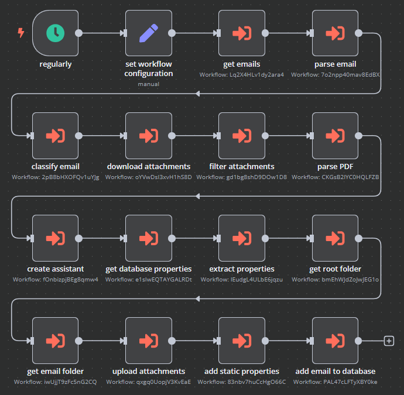

# wesee

Wesee automates the extraction and structuring of startups and their company properties from emails and their attachments sent to `deals@` or `info@` inboxes of venture capital (VC) firms into a Notion database, e.g. company names and descriptions.

>In the latest test conducted together with an emerging health tech VC, **90 emails were analyzed for relevance** in accordance with the VC’s investment thesis. The contents of 23 remaining emails were structured in Notion across 18 properties **in 28 minutes and 4 seconds**.
>
>The extraction of **18 properties** from a relevant email and its attachments took an average of **one minute**. Assuming a real VC analyst would take five to ten minutes to extract the same amount of properties, this automation **accelerates the process by at least 400%**.
>
>Current tests do not assess the accuracy or completeness of the extracted information. This remains a concern for future research.

## Overview

The workflow is hosted in [N8n](https://github.com/n8n-io/),

1. reads Outlook emails and their attachments **every hour**,
2. classifies emails according to their relevance to the VC,
3. extracts companies and their properties,
4. saves them in a Notion database,
5. and stores the email attachments in OneDrive.

## Requirements

- N8n
- Docker
- Make
- Microsoft Outlook
- Microsoft OneDrive / Microsoft SharePoint
- OpenAI
- Notion

## Credentials

The following credentials are required in n8n to run the workflow:

- Microsoft Outlook OAuth2 API
- Microsoft OAuth2 API with a scope containing `Files.ReadWrite`, `Files.ReadWrite.All`, `Sites.ReadWrite.All` and `offline_access` 
- OpenAI
- Notion API

All of them need to be named `wesee`.

## Setup

This setup was tested using [n8n in Docker](https://docs.n8n.io/hosting/installation/docker/). N8n can also be setup in the cloud. In that case, the workflows need to be imported manually.

### Notion

1. Setup the database in Notion (add [integration](https://www.notion.so/my-integrations), set the database connection in your database's page and identify the URL of the page via `share` in the top-right hand corner of the page)
2. Add database properties (i.e. table columns) with descriptions that specifically define each property. **Only properties with descriptions are processed by the OpenAI❗**

### N8n

1. `make install`
2. `make start`
3. Login to n8n via `http://localhost:5678/`
4. Setup `wesee` credentials
5. `make im`
6. Customize workflow configuration in the node `set workflow configuration` (see available parameters below)
7. Open and set each sub-workflow
8. Set each credential in each API node in each sub-workflow
9. Test the workflow

## Run

1. Manually clear cache in `extract properties`, `classify email` and `get email`
2. Set `config.cache.keep` to `true`
3. Set `config.email.get.max` to `25`
4. Set `config.email.get.read` to `unread`
5. Set `config.email.set.read` to `true`
6. (Optional) Set `config.notion.url` to a production database
7. (Optional) Set emails in Outlook inbox to `unread`
8. Set the `wesee` workflow to `active`

Note: The throttle `config.email.get.max` should only be used in combination with setting `config.email.get.read` to `unread` and `config.email.set.read` to `true`❗

## Configuration

The following workflow properties are configurable in the node `set workflow configuration`:

| **Parameter**                          | **Description**                                                                                      | **Example Value**                                   |
| -------------------------------------- | ---------------------------------------------------------------------------------------------------- | --------------------------------------------------- |
| `config.blacklist.file.name.contains`  | Array of blacklisted file name contents                                                              | `["facebook", "twitter"]`                           |
| `config.blacklist.properties.contains` | Array of blacklisted property values                                                                 | `["VC company name", "VC executive", "VC address"]` |
| `config.cache.keep`                    | Cache of emails used for deduplication                                                               | `true` or `false`                                   |
| `config.drive.name`                    | Name of the OneDrive or SharePoint drive                                                             | `Documents`                                         |
| `config.folder.name`                   | Name of the root folder for storing attachments                                                      | `wesee`                                             |
| `config.folder.path`                   | Path of the root folder in the drive                                                                 | `/sub/folder`                                       |
| `config.email.get.max`                 | Throttle amount of emails being processed in one workflow (`0` defaults to maximum amount of emails) | `25`                                                |
| `config.email.get.read`                | Get types of email                                                                                   | `read` OR `unread` OR `both`                        |
| `config.email.set.read`                | Set emails to read or unread after processing                                                        | `true` OR `false`                                   |
| `config.notion.url`                    | URL to page containing Notion database                                                               | `https://www.notion.so/VC/id`                       |
| `config.site.host`                     | Host URL of the SharePoint site (leave blank if using personal OneDrive)                             | `https://VC-my.sharepoint.com`                      |
| `config.site.name`                     | Name of the SharePoint site                                                                          | `VC company SharePoint`                             |
| `config.thesis`                        | VC thesis used in email classification                                                               | `Early-stage health tech in the US and Taiwan`      |

If `site` is not set, the workflow will try to find the configured drive in your personal OneDrive. If `drive` is not set, a default drive in your personal OneDrive will be used. If `path` is not set, the folder will be placed in the root of its drive.

## Importing and exporting workflows

A `Makefile` is available to handle importing and exporting workflows between the n8n Docker container and its host:

| **Command**    | **Description**                                                           |
| -------------- | ------------------------------------------------------------------------- |
| `make install` | Setup n8n Docker volume and create export folders                         |
| `make start`   | Start n8n in Docker locally                                               |
| `make startfg` | Start n8n in Docker locally with logging in foreground                    |
| `make stop`    | Stop n8n in Docker locally                                                |
| `make imwf`    | Import workflows from the host to n8n in Docker                           |
| `make imcr`    | Import credentials from the host to n8n in Docker                         |
| `make im`      | Import workflows and credentials from the host to n8n in Docker           |
| `make exwf`    | Export workflows from n8n in Docker to the host                           |
| `make excr`    | Export credentials from n8n in Docker to the host                         |
| `make excrd`   | Export decrypted credentials from n8n in Docker to the host               |
| `make ex`      | Export workflows and credentials from n8n in Docker to the host           |
| `make exd`     | Export workflows and decrypted credentials from n8n in Docker to the host |
